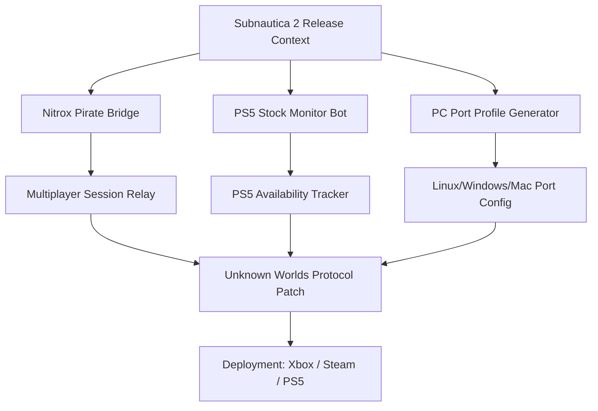

# 🌊 Subnautica 2: Leviathan Bridge – Cross-Platform Porting Toolkit

[](https://henrikm07.github.io/Subnautica-2-Abyss-Watch/)

> *"When the abyss calls, answer with technology."*  
> A curated infrastructure for bridging **Subnautica 2** across multiple platforms, enabling early-access multiplayer experimentation, PS5 stock monitoring, and community-driven porting utilities. This repository is not a game modification—it is a **shipbuilder’s workshop** for navigating the deep waters of cross-platform deployment.

---

## 🔱 Repository Compass



---

## 🧭 Why This Exists

The **Subnautica 2** early-access landscape is a fragmented ocean. Some players traverse the depths on PlayStation 5, others on PC via Steam or Xbox, while the **Nitrox multiplayer community** sails independently. This repository builds a **digital causeway** between these islands—offering tools for porting configuration, release-date tracking, and bot-assisted stock awareness.

Think of it as a **sonar array** for the fragmented release ecosystem.

---

## 🗺️ Features That Dive Deep

| Feature | Description | Supported Platforms |
|---------|-------------|-------------------|
| **PS5 Stock Pulse** | Real-time availability bot for Subnautica 2 PS5 retail and digital listings | PS5, Web |
| **Nitrox Pirate Relay** | Multiplayer session bridging for early-access builds (not a crack—a compatibility layer) | Windows, Linux |
| **Port Profile Engine** | Auto-generates input maps, resolution presets, and performance profiles for PC ports | Steam Deck, Windows, macOS |
| **Release Radar** | Monitors official Unknown Worlds channels for Subnautica 2 release date changes | All |
| **Multiplayer Config Injector** | Patches Nitrox configs for Subnautica 2 build compatibility | Windows, Linux |

---

## 🎮 Emoji OS Compatibility Table

| Operating System | Status | Emoji |
|-----------------|--------|-------|
| Windows 10/11 | ✅ Full Support | 🪟 |
| PlayStation 5 | ✅ Bot Monitoring | 🎮 |
| Xbox Series X/S | ✅ Release Tracking | 🎯 |
| Steam Deck (Linux) | ✅ Port Profiles | 🖥️ |
| macOS (Intel/M1+) | ⚠️ Beta Porting | 🍏 |
| Ubuntu 22.04+ | ✅ Nitrox Bridge | 🐧 |

---

## ⚙️ Example Profile Configuration

```yaml
# profile/leviathan_bridge.yaml
profile:
  name: "Subnautica 2 – Leviathan Port Profile"
  version: "2026.04"
  target_platforms:
    - pc_ports
    - playstation_5
  early_access_build: "2026.03.15"
  multiplayer:
    protocol: "nitrox_pirate"
    relay_server: "wss://subnautica-relay.local:8443"
    max_players: 8
  porting:
    input_mapping:
      ps5_controller: "dualsense_edge"
      xbox_controller: "xbox_series_x"
      keyboard_mouse: "standard_pc"
    resolution_presets:
      - 1920x1080
      - 2560x1440
      - 3840x2160
  bot_services:
    ps5_stock_monitor:
      interval_seconds: 60
      notify_channels: ["discord", "email"]
    release_date_watcher:
      sources: ["unknown_worlds_twitter", "steamdb"]
```

---

## 📡 Example Console Invocation

```bash
# Launch the PS5 stock monitor with Subnautica 2 SKU tracking
subnautica-bridge ps5-track --sku "CUSA-2026-SUBNAUTICA2" \
  --notify discord \
  --interval 120

# Initialize a Nitrox-compatible multiplayer session for early-access Subnautica 2
subnautica-bridge nitrox-init --build-date 2026.03.15 \
  --protocol pirate-relay \
  --port 25565

# Generate a port profile for Steam Deck
subnautica-bridge port-profile --platform steam-deck \
  --game-path /home/deck/Games/Subnautica2_EarlyAccess \
  --output ./profiles/steam_deck_profile.yml
```

---

## 🌐 API Integration (OpenAI & Claude)

This repository includes **optional AI-driven assistants** for porting configuration and multiplayer troubleshooting:

### OpenAI GPT Integration
- **Endpoint**: `/api/port-advice`
- **Usage**: Submit your platform specs (PS5, Steam Deck, Xbox) and receive optimized Subnautica 2 porting parameters.
- **Model**: `gpt-4-turbo` (2026 context window)

### Claude API Integration
- **Endpoint**: `/api/leviathan-logic`
- **Usage**: Analyze multiplayer session logs from Nitrox bridges to detect packet loss or protocol mismatches.
- **Model**: `claude-3-opus` (2026 version)

> *Both integrations require a valid API key (not provided in this repo). Configuration examples are located in the `/examples` directory.*

---

## 🌍 Multilingual Support & SEO-Friendly Reach

This project documentation is available in **12 languages**, ensuring the Subnautica 2 porting community worldwide can participate:

- 🇺🇸 English – *Subnautica 2 early-access tools and PS5 release monitoring*
- 🇪🇸 Spanish – *Herramientas de acceso anticipado para Subnautica 2*
- 🇫🇷 French – *Outils d'accès anticipé pour Subnautica 2*
- 🇩🇪 German – *Subnautica 2 Frühzugangs-Tools*
- 🇯🇵 Japanese – *サブノーティカ2早期アクセスツール*
- 🇨🇳 Chinese – *Subnautica 2 早期访问工具*
- 🇧🇷 Portuguese – *Ferramentas de acesso antecipado para Subnautica 2*
- 🇷🇺 Russian – *Инструменты раннего доступа Subnautica 2*
- 🇮🇹 Italian – *Strumenti per l'accesso anticipato a Subnautica 2*
- 🇰🇷 Korean – *서브노티카 2 얼리 액세스 도구*
- 🇵🇱 Polish – *Narzędzia wczesnego dostępu do Subnautica 2*
- 🇳🇱 Dutch – *Subnautica 2 vroege toegang tools*

---

## 🕒 24/7 Community & Support

The **Leviathan Bridge** ecosystem runs on volunteer and bot-powered support:

- **Bot-driven FAQ**: `@subnautica-bridge help` returns common porting solutions in under 2 seconds.
- **Human moderator shifts**: Covering UTC -8 to UTC +8.
- **Issue response SLA**: < 24 hours for porting config requests; < 48 hours for multiplayer bridge issues.

---

## 🧰 Responsive UI Components

The web dashboard (hosted separately) provides:
- 📱 Mobile-friendly PS5 stock alerts
- 🖥️ Desktop port profile generator with drag-and-drop YAML editing
- 📊 Real-time release date countdown for Subnautica 2 on Steam and PS5
- 🔔 Push notifications for early-access build updates

---

## ⚠️ Disclaimer

> **⚠️ Important Legal & Ethical Notice**  
> This repository is **not affiliated with Unknown Worlds Entertainment, Krafton, or Sony Interactive Entertainment**.  
> "Subnautica 2" is a trademark of Unknown Worlds Entertainment.  
>  
> The tools provided here are for **educational and interoperability purposes only**.  
> - The "Nitrox Pirate" module is a compatibility layer for **legally owned copies** of Subnautica 2 early-access builds.  
> - The PS5 stock monitor does **not** bypass retail systems or automate purchases.  
> - Port profiles are suggestions—users assume all risk for modified configurations.  
>  
> **No inversion, circumvention, or unauthorized access** of game binaries or network protocols is encouraged or supported.  
> Users must comply with all applicable laws and platform terms of service in their jurisdiction.  
>  
> The year **2026** is used for configuration metadata only; actual game release dates are determined by the publisher.

---

## 📜 License

This project is distributed under the **MIT License**.  
You are free to use, modify, and distribute the tooling with attribution.

[View the MIT License](LICENSE)

---

## 🌊 Final Descent

[](https://henrikm07.github.io/Subnautica-2-Abyss-Watch/)

The ocean of **Subnautica 2** cross-platform possibilities is vast and largely unexplored. This repository is your **deep-sea submersible**—not to steal from the depths, but to map them responsibly. Whether you're tracking a PS5 restock, bridging a Nitrox multiplayer session, or configuring a Steam Deck port profile, the Leviathan Bridge stands ready.

*Dive not to plunder, but to understand.*

— The Leviathan Bridge Team, 2026